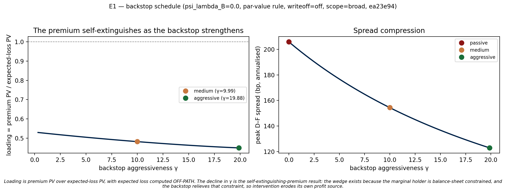

# Policy experiments — standard results

*Generated 2026-08-18T12:31:10 from `ea23e94` · **working tree DIRTY** · calibration `86c89892` · scope `broad` · `psi_lambda_B=0.0` · `mv_rule=0` · `recovery_rate=0.3` · `writeoff_enabled=0` · `zeta_writeoff=1`*

Generated by `experiments/run_all.py`. **Do not edit by hand** — edit the experiment and re-run, or the next run discards the edit. Design spec: `docs/superpowers/specs/2026-08-01-policy-experiments-design.md`.

## E1 — Backstop schedule

*Generated 2026-08-18T12:31:06 from `ea23e94` · **working tree DIRTY** · calibration `86c89892` · scope `broad` · `psi_lambda_B=0.0` · `mv_rule=0` · `recovery_rate=0.3` · `writeoff_enabled=0` · `zeta_writeoff=1`*

γ selection: γ is **solved** for peak-spread compression, not chosen. `medium` = 25% (spec section 7). **`aggressive` is NOT 50%**: since the 2026-08-18 GK structural refactor that target lies beyond a closed-loop pole at γ ≈ 27.3, so it falls back to the strongest intervention the model can represent — γ just below the pole, achieving **≈46.6%**. See `common.named_regime_gammas` / `lottery_math.closed_loop_pole`.

Rule recorded in the results file at run time: gamma SOLVED for peak-spread compression, not chosen. medium = 25% (spec section 7). aggressive was 50%, but since the 2026-08-18 GK structural refactor that target lies beyond a closed-loop pole at gamma ~ 27.3 and is unreachable; it falls back to the strongest intervention the model can represent, gamma just below the pole, achieving ~46.6%. DO NOT describe the aggressive regime as 50% compression -- see common.named_regime_gammas and lottery_math.closed_loop_pole.

| regime | γ | peak spread (bp ann) | Y_D[0] (% SS) | C_D[0] (% SS) | I_D[0] (% SS) | n_inter_D[0] (% SS) | loading |
|---|---|---|---|---|---|---|---|
| passive | 0.0000 | 205.9 | -1.9742 | -2.5108 | -3.0046 | -11.407 | n/a |
| medium | 9.9894 | 154.4 | -0.3287 | +0.0792 | -1.6100 | -5.541 | 0.48 |
| aggressive | 19.8750 | 122.9 | +0.6830 | +1.6963 | -0.8053 | -2.037 | 0.45 |

### A5-1 — three separate objects

**Do not sum these into an 'implicit transfer'.** Expected loss is computed off-path; reading it off the realised path shows the CB mechanically profiting, because the excess-return flow is a first-order deviation times a steady-state level and so does not vanish along the no-default branch.

| regime | exposure PV (% Y) | expected loss PV (% Y) | `pd_D` differential PV |
|---|---|---|---|
| passive | 0.0000 | 0.00000 | +0.000000 |
| medium | 6.0571 | 0.27036 | -0.013694 |
| aggressive | 11.2618 | 0.41108 | -0.020882 |

> **The third column is misnamed in the code and its sign needs an author decision.** It reports `Σ β^t (pd_passive − pd_intervention)`, which is negative because the backstop lets Greece run a *larger* primary deficit — it relaxes required austerity. So negative means Greece is better off, the opposite of what "fiscal saving" implies. Flip the sign or rename it ("austerity relief, PV") before quoting it. Magnitudes are unaffected.

### Loading schedule (Live Claim 5)

59 finite grid points over γ ∈ [0.34, 19.88]: loading falls from **0.53** to **0.45**. Monotone decreasing: **YES**.

The self-extinguishing premium is the *decline*, so the schedule — not any single point — is the object.

### Welfare (secondary)

SECONDARY. SPEC: do not lead with welfare — it is a delicate decomposition-dependent object and comes out near-exactly zero-sum.

| regime | W_D | W_F |
|---|---|---|
| passive | -2.6844 | +0.1722 |
| medium | -1.5568 | +0.0779 |
| aggressive | +0.2018 | -0.0239 |

## E2 — ΔY decomposition

*Generated 2026-08-18T12:30:46 from `ea23e94` · **working tree DIRTY** · calibration `86c89892` · scope `broad` · `psi_lambda_B=0.0` · `mv_rule=0` · `recovery_rate=0.3` · `writeoff_enabled=0` · `zeta_writeoff=1`*

Identity (`market_clearing_D`): `dY = P_ss·dC + C_ss·dP_CES + dI + dG + dΦ + dT + dNX`. `goods_mkt_D` is a targeted residual (≤1e−14), so this closes to solver tolerance — the decomposition is **self-verifying**, and the runner asserts closure at 1e-07 rather than warning.

| regime | Y_D[0] (% SS) | Y_D trough (% SS) | dI PV | dNX PV | dC(qty) PV | dC(price) PV | max\|residual\| |
|---|---|---|---|---|---|---|---|
| passive | -1.9742 | -1.9742 | -3.463e-02 | +9.647e-03 | -2.713e-02 | +2.960e-03 | 7.90e-17 |
| medium | -0.3287 | -0.3287 | -4.281e-02 | +3.248e-03 | +4.602e-03 | +2.181e-03 | 8.59e-17 |
| aggressive | +0.6830 | -0.1542 | -5.393e-02 | -2.112e-03 | +2.883e-02 | +1.311e-03 | 1.66e-16 |

### Impact (t=0) decomposition, level deviations

| component | passive | medium | aggressive |
|---|---|---|---|
| consumption_quantity | -1.696e-02 | +5.353e-04 | +1.146e-02 |
| consumption_price | +6.198e-04 | +3.674e-05 | -3.263e-04 |
| investment | -7.269e-03 | -3.895e-03 | -1.948e-03 |
| government | +0.000e+00 | +0.000e+00 | +0.000e+00 |
| portfolio_cost | +0.000e+00 | +0.000e+00 | +0.000e+00 |
| macropru_tax | +0.000e+00 | +0.000e+00 | +0.000e+00 |
| net_exports | +3.872e-03 | +3.554e-05 | -2.357e-03 |
| **dY[0] total** | **-1.974e-02** | **-3.287e-03** | **+6.830e-03** |

> **The headline output number is no longer a residue of larger offsetting channels — it now exceeds each of them.** passive → aggressive, `dY[0]` moves by +2.66e-02 while investment moves +5.32e-03 and net exports -6.23e-03 — the largest single channel is 0.23x the headline. **Report the decomposition, not the headline ΔY** — the channels still offset, and `docs/SPEC.md`'s standing caution is about their cancellation, not about which term happens to be largest.

> `government`, `portfolio_cost` and `macropru_tax` are **verified** zero, not merely uncached: `G_D` is constant and absent from the Jacobian, `Phi_D` has no Jacobian column (the portfolio adjustment cost is quadratic about its anchor, so its level deviation is second-order), and `T_D` is identically zero at `T0=T1=0`. The identity closes *because* all three are genuinely zero.

## E3 — S-1 writeoff

*Generated 2026-08-18T12:06:02 from `ea23e94` · **working tree DIRTY** · calibration `86c89892` · scope `broad` · `psi_lambda_B=0.0` · `mv_rule=0` · `recovery_rate=0.3` · `writeoff_enabled=0` · `zeta_writeoff=1`*

The two switches answer different questions. `writeoff_enabled` selects which BRANCH the impulse response traces and is steady-state-neutral: every realised writeoff term is multiplied by `def_rate_ss = 0`. `zeta_writeoff` governs what is PRICED — whether a default writes down the perpetuity's continuation value alongside its coupon. Both are SS-neutral, for the same reason: every writeoff term is multiplied by `def_rate_ss = 0`, inside `rb_exp` as well as inside `rb_actual`. So `zeta_writeoff` is allocation-neutral while still changing the linearised pricing equation, and hence every dynamic result. Since the 2026-08-18 refactor the baseline is `zeta_writeoff = 1`; `e3b_coupon_only_pricing` is the §12 Arm-3 diagnostic showing what the pre-refactor coupon-only payoff was worth.

| setting | `writeoff_enabled` | `zeta_writeoff` | EL_load_D | peak spread, passive (bp ann) | loading (medium) | loading (aggressive) |
|---|---|---|---|---|---|---|
| baseline | 0 | 1.0 | 0.701400 | 205.9 | 0.48 | 0.47 |
| e3a_realised_writeoff | 1 | 1.0 | 0.701400 | 122.7 | 0.36 | 0.32 |
| e3b_coupon_only_pricing | 0 | 0.0 | 0.055790 | 12.3 | 0.48 | 0.43 |

γ note: solved on the BASELINE and held fixed across variants, so a difference in the table is attributable to the switch alone. `medium` = 25% peak-spread compression; **`aggressive` is ≈46.6%, not 50%** — see the E1 note above.

Note recorded in the results file at run time: Solved on the BASELINE (0/25/50% peak-spread compression) and held fixed across variants, so a difference in the table is attributable to the writeoff switch alone. Under e3b_full the peak spread is not monotone in gamma, so these targets are not even well-defined there — see compression.

### What the payoff specification is worth

`EL_load_D` is the expected loss per unit of default probability implied by the bond contract. Coupon-only pricing (`zeta_writeoff = 0`) puts it at `(1-rec)·delta_b/q_b`; full pricing puts it at `(1-rec)·[delta_b + (1-delta_b)q_b]/q_b`, larger by roughly `[delta_b + (1-delta_b)q_b]/delta_b ≈ 12.6` on a 12.9-quarter claim. Read the loading column with that denominator in mind: it is premium income per unit of expected loss ABSORBED, so a bigger, better-specified loss lowers it mechanically without the central bank earning any less.

| variant | regime | EL PV (% Y) | premium PV (% Y) | loading |
|---|---|---|---|---|
| baseline | medium | 0.27036 | 0.13022 | 0.48 |
| baseline | aggressive | 0.50132 | 0.23467 | 0.47 |
| e3a_realised_writeoff | medium | 0.09947 | 0.03559 | 0.36 |
| e3a_realised_writeoff | aggressive | 0.19282 | 0.06158 | 0.32 |
| e3b_coupon_only_pricing | medium | 0.00136 | 0.00066 | 0.48 |
| e3b_coupon_only_pricing | aggressive | 0.00305 | 0.00133 | 0.43 |

### Verification

| variant | EL_load (closed form) | EL_load (solved) | ×baseline | max SS drift |
|---|---|---|---|---|
| e3a_realised_writeoff | 0.701400 | 0.701400 | 1.00× | 0.000e+00 |
| e3b_coupon_only_pricing | 0.055790 | 0.055790 | 0.08× | 0.000e+00 |

Both variants require a full SS + Jacobian re-solve: patching the solved SS and re-solving only the Jacobian would presume the very invariance these variants exist to test.

> **Both variants must show zero SS drift.** Measured 2026-08-18: `q_b_D = 0.974906` in all three arms. Every writeoff term — priced or realised — is multiplied by `def_rate_ss = 0`, so neither switch moves an allocation. What `zeta_writeoff` does move is `EL_load_D` (0.0558 -> 0.7014, 12.6x) and hence the linearised pricing equation: peak spread on a 1pp shock goes 12.3bp -> 205.9bp. Allocation-neutral, dynamically decisive.

### Is compression targeting even well-defined?

The named regimes are *defined* as 25%/50% peak-spread compression, found by bisection — which requires peak spread to be monotone in γ.

| setting | monotone in γ? | peak @ γ=0 (bp) | min peak (bp) | γ at min | violations |
|---|---|---|---|---|---|
| baseline | yes | 205.9 | 136.7 | 15.00 | 0 |
| e3a_realised_writeoff | yes | 122.7 | 91.9 | 15.00 | 0 |
| e3b_coupon_only_pricing | yes | 12.3 | 10.1 | 15.00 | 0 |

> **Under full writeoff the named-regime construction itself breaks.** Peak spread stops being monotone in γ, so "25% compression" no longer identifies a unique γ. The violations are two of 39 grid steps: a trivial one at γ≈0.39 and a large spike at γ≈3.46 (144.4 → 166.6 bp), after which the curve resumes falling. That isolated spike sits where `I − γ·A_cb` is plausibly near-singular, so read it as a linear-algebra pathology rather than economics until confirmed — but compression-targeted regimes cannot be defined under this setting, which is why every row above is evaluated at the baseline's γ held fixed.

> `psi_lambda_B = 0` was tuned to 150 bp with realised losses **off**. The overshoot above is a reportable fact about whether that target survives S-1 — **not** a number to re-tune away. Whether to re-tune is a separate author decision this result informs.

