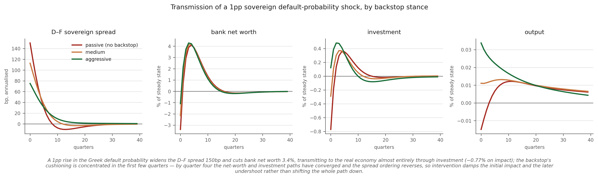
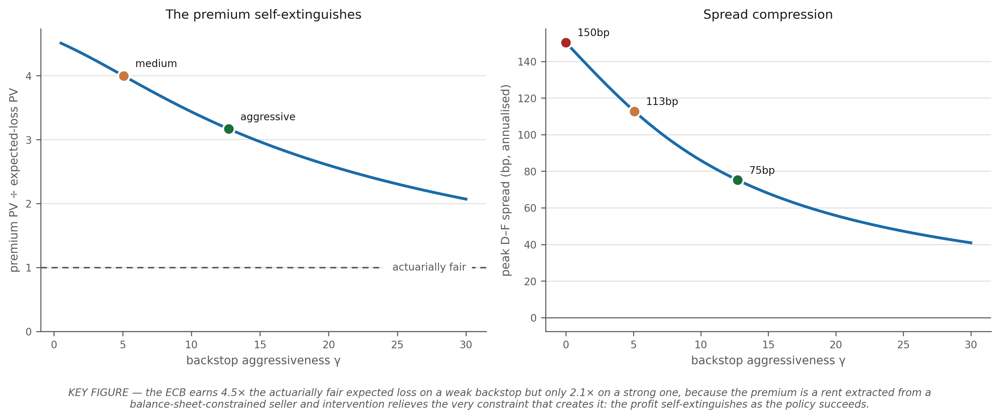
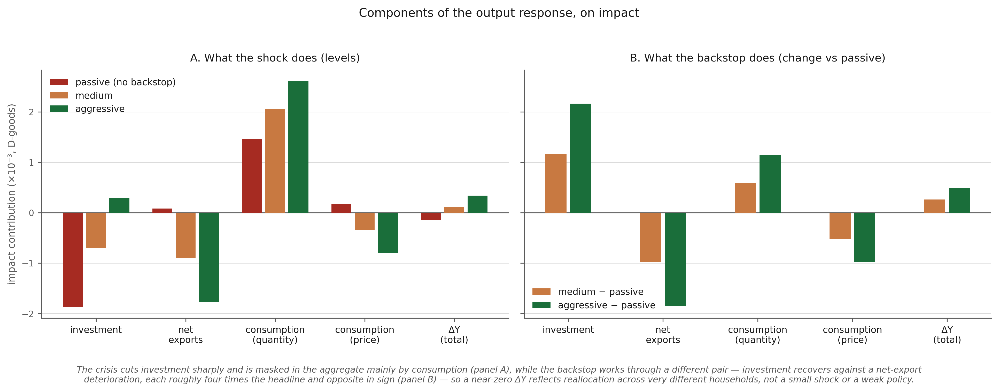
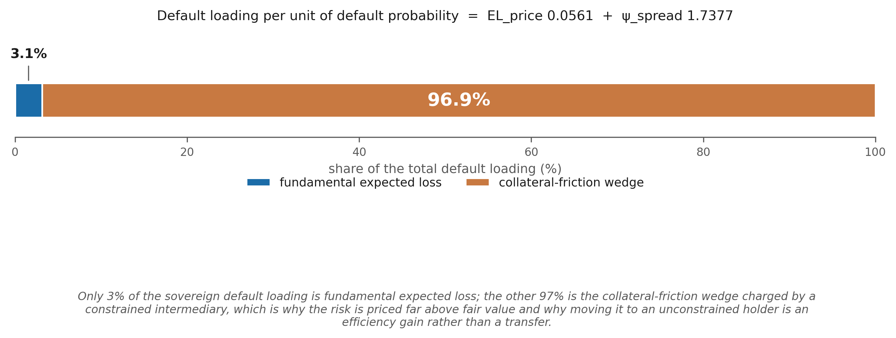
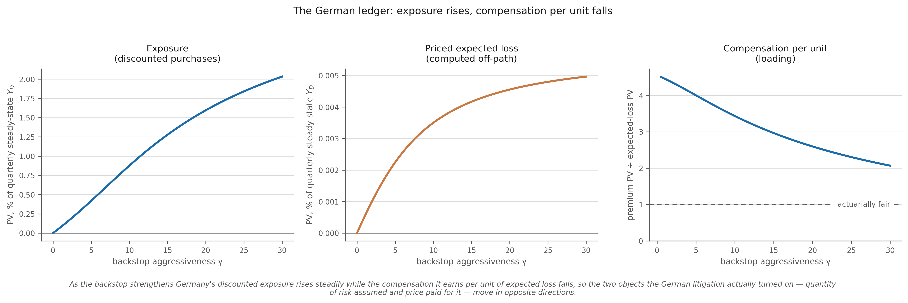

# First-draft results — tables and figures

*Generated 2026-08-04T11:26:47 from `ff948ac` · calibration `de195df2` · `BANK_SCOPE=broad` · `writeoff_enabled=0` (pure risk-premium framing, S-1 resolved 2026-08-04).*

Generated by `experiments/paper_outputs.py`. Every number is read live from the solved steady state or the cached response matrices — none is transcribed. Figures are in `experiments/paper/`, each with its caption baked into the image.

## Table 1 — Calibration and identification ledger

The distinction that matters for a referee is *which* parameters are measured, which are matched to a target, and which are free. Only one amplification dial is free.

| Parameter | Value | Status | Source / target |
|---|---|---|---|
| `theta_D` / `theta_F` | 5.511 / 6.941 | **measured** | EBA 2011 disclosure: GK-eligible assets (corporate ex-CRE + CRE + sovereign) EAD ÷ Core Tier 1 |
| `delta_b_D` / `delta_b_F` | 0.0777 / 0.0568 | **measured** | EBA sovereign maturity ladder repriced at the 31-Dec-2010 market yield; modified duration 3.12y (GGB) / 4.22y (Bund) |
| `phi_bD_D` (own-book concentration) | 0.456 | **measured** | EBA 2011 bank-held sovereign book ÷ capital, broad-sector scope |
| `b_F_D` (cross-holdings) | 0.0077 | **measured** | EBA 2011 bilateral GR/DE exposures |
| `n_inter_D` / `n_inter_F` | 2.138 / 1.627 | *implied* | `(Q·K + sovereign) / theta` — follows from measured leverage and the balance sheet |
| `recovery_rate` | 0.30 | *external estimate* | Zettelmeyer, Trebesch & Gulati (PIIE WP13-8): 59–65% investor NPV loss in the March 2012 Greek PSI |
| `psi_lambda_B` | 8.50 | **FREE — the one amplification dial** | matched to the ~150bp 2010 GR–DE spread on a 1pp default shock; no EBA counterpart |
| `def_scale` | 0.25 | free | strong-amplification choice; exceeds the 0.12–0.23 GR-2011 range |
| `Delta_bD_D` / `Delta_bF_D` | 0.20 / 0.40 | **unidentified** | no EBA counterpart; the GK feasibility inequality bounds but does not pin them |
| `phi_lamb` | 0.15 | free | fiscal feedback; literature (Staehr 2008) is 0.025–0.038 quarterly |
| `f` (banker exit) | 0.12 | free | standard GK range is ~0.03 |

## Table 2 — Moment match

| Moment | Target | Model | Source |
|---|---|---|---|
| Peak D–F spread, 1pp default shock | ~150 bp ann. | **150.3 bp** | 2010 GR–DE 10y spread |
| Capital–output ratio `K/Y` (annual) | 2.70 | **2.70** | conventional |
| Steady-state return on capital `rk` | 0.0100 | **0.010000** | conventional quarterly |
| Bank net-worth pass-through | −1.8 to −8.6 %/100bp | **-2.25 %/100bp** | Acharya–Drechsler–Schnabl (2014 JF) bank-equity-on-sovereign-CDS elasticity, converted at three baselines |
| Steady-state D and F bond yields | equalised | 0.002491 / 0.002491 | model restriction |

## Table 3 — Main results

| | passive | medium | aggressive |
|---|---|---|---|
| backstop coefficient γ | 0.000 | 5.080 | 12.726 |
| peak D–F spread (bp ann.) | 150.3 | 112.7 | 75.2 |
| output, impact (% SS) | -0.0149 | +0.0111 | +0.0338 |
| investment, impact (% SS) | -0.7718 | -0.2903 | +0.1217 |
| bank net worth, impact (% SS) | -3.380 | -2.167 | -1.099 |
| ECB exposure PV (% of quarterly $Y_D$) | 0.0000 | 0.4265 | 1.1062 |
| priced expected loss PV (% of $Y_D$) | 0.00000 | 0.00228 | 0.00391 |
| **loading (premium ÷ expected loss)** | n/a | **4.00** | **3.17** |

Default loading decomposition: `EL_price = 0.056134`, `psi_spread = 1.737724` → fundamental expected loss is **3.1%** of the total and the collateral-friction wedge is **96.9%**.

## Figures

### `fig01_transmission`

A 1pp rise in the Greek default probability widens the D–F spread 150bp and cuts bank net worth 3.4%, transmitting to the real economy almost entirely through investment (−0.77% on impact); the backstop's cushioning is concentrated in the first few quarters — by quarter four the net-worth and investment paths have converged and the spread ordering reverses, so intervention damps the initial impact and the later undershoot rather than shifting the whole path down.

### `fig02_loading_schedule`

KEY FIGURE — the ECB earns 4.5× the actuarially fair expected loss on a weak backstop but only 2.1× on a strong one, because the premium is a rent extracted from a balance-sheet-constrained seller and intervention relieves the very constraint that creates it: the profit self-extinguishes as the policy succeeds.

### `fig03_dy_decomposition`

The crisis cuts investment sharply and is masked in the aggregate mainly by consumption (panel A), while the backstop works through a different pair — investment recovers against a net-export deterioration, each roughly four times the headline and opposite in sign (panel B) — so a near-zero ΔY reflects reallocation across very different households, not a small shock or a weak policy.

### `fig04_spread_decomposition`

Only 3% of the sovereign default loading is fundamental expected loss; the other 97% is the collateral-friction wedge charged by a constrained intermediary, which is why the risk is priced far above fair value and why moving it to an unconstrained holder is an efficiency gain rather than a transfer.

### `fig05_incidence`

As the backstop strengthens Germany's discounted exposure rises steadily while the compensation it earns per unit of expected loss falls, so the two objects the German litigation actually turned on — quantity of risk assumed and price paid for it — move in opposite directions.

