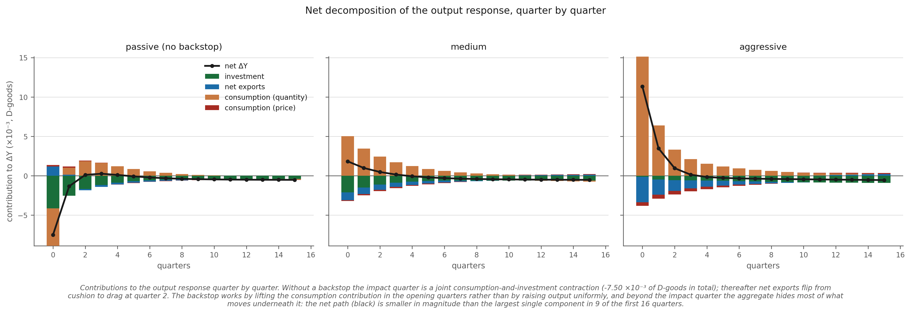
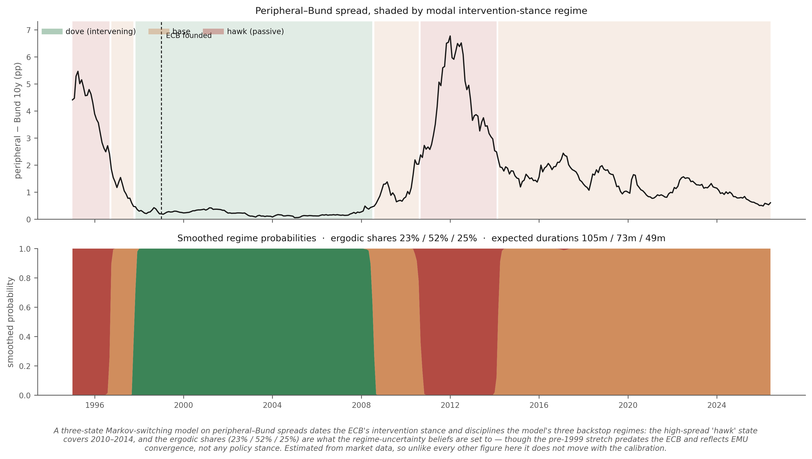
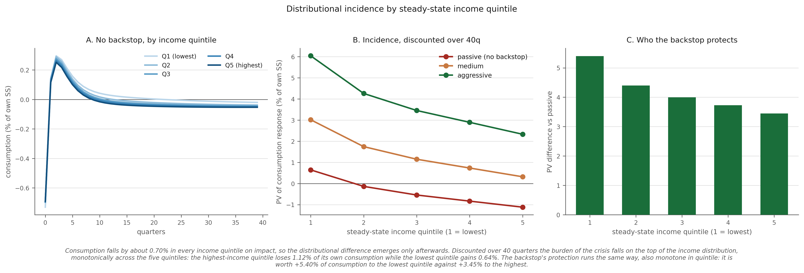

# First-draft results — tables and figures

*Generated 2026-08-06T17:43:32 from `ec4f862` · calibration `14989c17` · `BANK_SCOPE=broad` · `writeoff_enabled=0` (pure risk-premium framing, S-1 resolved 2026-08-04).*

Generated by `experiments/paper_outputs.py`. Every number is read live from the solved steady state or the cached response matrices — none is transcribed. Figures are in `experiments/paper/`, each with its caption baked into the image. **The captions are derived too**: each is built by its own figure function from the arrays that figure plots, so a caption cannot contradict a table below it the way the hardcoded set did between the sticky-price conversion and 2026-08-06.

## Table 1 — Calibration and identification ledger

The distinction that matters for a referee is *which* parameters are measured, which are matched to a target, and which are free. Only one amplification dial is free.

| Parameter | Value | Status | Source / target |
|---|---|---|---|
| `theta_D` / `theta_F` | 5.511 / 6.941 | **measured** | EBA 2011 disclosure: GK-eligible assets (corporate ex-CRE + CRE + sovereign) EAD ÷ Core Tier 1 |
| `delta_b_D` / `delta_b_F` | 0.0777 / 0.0568 | **measured** | EBA sovereign maturity ladder repriced at the 31-Dec-2010 market yield; modified duration 3.12y (GGB) / 4.22y (Bund) |
| `phi_bD_D` (own-book concentration) | 0.456 | **measured** | EBA 2011 bank-held sovereign book ÷ capital, broad-sector scope |
| `b_F_D` (cross-holdings) | 0.0077 | **measured** | EBA 2011 bilateral GR/DE exposures |
| `n_inter_D` / `n_inter_F` | 2.138 / 1.627 | *implied* | `(Q·K + sovereign) / theta` — follows from measured leverage and the balance sheet |
| `recovery_rate` | 0.30 | *external estimate* | Zettelmeyer, Trebesch & Gulati (PIIE WP13-8): 59–65% investor NPV loss in the March 2012 Greek PSI |
| `psi_lambda_B` | 2.92 | **FREE — the one amplification dial** | matched to the ~150bp 2010 GR–DE spread on a 1pp default shock; no EBA counterpart |
| `def_scale` | 0.25 | free | strong-amplification choice; exceeds the 0.12–0.23 GR-2011 range |
| `Delta_bD_D` / `Delta_bF_D` | 0.20 / 0.40 | **unidentified** | no EBA counterpart; the GK feasibility inequality bounds but does not pin them |
| `phi_lamb` | 0.15 | free | fiscal feedback; literature (Staehr 2008) is 0.025–0.038 quarterly |
| `f` (banker exit) | 0.12 | free | standard GK range is ~0.03 |

## Table 2 — Moment match

| Moment | Target | Model | Source |
|---|---|---|---|
| Peak D–F spread, 1pp default shock | ~150 bp ann. | **150.1 bp** | 2010 GR–DE 10y spread |
| Capital–output ratio `K/Y` (annual) | 2.70 | **2.70** | conventional |
| Steady-state return on capital `rk` | 0.0100 | **0.010000** | conventional quarterly |
| Bank net-worth pass-through | −1.8 to −8.6 %/100bp | **-4.18 %/100bp** | Acharya–Drechsler–Schnabl (2014 JF) bank-equity-on-sovereign-CDS elasticity, converted at three baselines |
| Steady-state D and F bond yields | equalised | 0.002491 / 0.002491 | model restriction |

## Table 3 — Main results

| | passive | medium | aggressive |
|---|---|---|---|
| backstop coefficient γ | 0.000 | 3.103 | 8.973 |
| peak D–F spread (bp ann.) | 150.1 | 112.6 | 75.0 |
| output, impact (% SS) | -0.7502 | +0.1834 | +1.1336 |
| investment, impact (% SS) | -1.7107 | -0.8688 | -0.0508 |
| bank net worth, impact (% SS) | -6.271 | -2.922 | +0.469 |
| ECB exposure PV (% of quarterly $Y_D$) | 0.0000 | 1.5331 | 4.0737 |
| priced expected loss PV (% of $Y_D$) | 0.00000 | 0.00518 | 0.01058 |
| **loading (premium ÷ expected loss)** | n/a | **5.48** | **5.17** |

Default loading decomposition: `EL_price = 0.056134`, `psi_spread = 0.596959` → fundamental expected loss is **8.6%** of the total and the collateral-friction wedge is **91.4%**.

## Table 4 — Distributional incidence, by income quintile

PV of the consumption response over 40 quarters, % of each quintile's own steady-state consumption. Bins are cut on the **exogenous income state**, whose marginal distribution is the stationary distribution of the Markov chain and is therefore invariant to the shock — verified numerically at `max|Δmass| ≈ 1e−19`. The per-capita response is consequently *purely behavioural*.

| income quintile | passive | medium | aggressive | backstop gain |
|---|---|---|---|---|
| Q1 (lowest) | +0.6447 | +3.0172 | +6.0428 | +5.3981 |
| Q2 | -0.1367 | +1.7457 | +4.2615 | +4.3982 |
| Q3 | -0.5444 | +1.1487 | +3.4554 | +3.9998 |
| Q4 | -0.8339 | +0.7328 | +2.8947 | +3.7286 |
| Q5 (highest) | -1.1203 | +0.3182 | +2.3299 | +3.4502 |

> **Do not run this cut on wealth.** Binning on steady-state deposits with fixed boundaries makes the per-capita number overwhelmingly *composition*: the deposit distribution shifts across the thresholds, bin masses move by 2–3e−3 (2–3% of bin mass), and the net is a small residue of two large nearly-cancelling terms — bottom decile, PV: −41.6 consumption against −44.4 mass, netting +2.8. The arithmetic is exact and the object is well defined, but it must not be described as how poor households behaved.

## Figures

### `fig01_transmission`

A 1pp rise in the Greek default probability widens the D–F spread to a peak of 150bp, cuts bank net worth 6.3% and investment 1.7% on impact, and takes output -0.75% from steady state; the backstop's cushioning is concentrated in the opening quarters — the spread ordering by quarter 22 as the unaided economy overshoots on the rebound, so intervention damps the impact quarter rather than shifting the whole path down.

### `fig02_loading_schedule`

KEY FIGURE — the ECB's compensation per unit of expected loss falls monotonically from 5.65× at γ=0.51 to 4.59× at γ=30 and stays above the actuarially fair benchmark of 1 throughout; medium 5.48×, aggressive 5.17× at the named regimes (peak spread compresses 150bp → 35bp over the same grid). The premium is a rent extracted from a balance-sheet-constrained seller and intervention relieves the very constraint that creates it: the profit self-extinguishes as the policy succeeds.

### `fig03_dy_decomposition`

On impact the crisis is a joint contraction: consumption contributes -4.74 and investment -4.14 (×10⁻³ of D-goods) against a +1.17 net-export cushion, summing to -7.50 (panel A). The backstop works through the same margin rather than a different one: moving passive → aggressive raises ΔY by +18.84, of which consumption supplies +1.06×, with investment at +0.21× and net exports at -0.23× largely offsetting each other (panel B). So the headline ΔY is a residue of larger offsetting channels, which is why the decomposition and not the headline is the object to report.

### `fig04_spread_decomposition`

Only 8.6% of the sovereign default loading is fundamental expected loss (EL_price = 0.0561); the other 91.4% is the collateral-friction wedge charged by a constrained intermediary (ψ_spread = 0.5970, linear in the one free amplification parameter). That is why the risk is priced far above fair value, and why moving it to an unconstrained holder is an efficiency gain rather than a transfer.

### `fig05_incidence`

As the backstop strengthens Germany's discounted exposure rises steadily — from zero to 11.23% of quarterly steady-state $Y_D$ at γ=30 — while the compensation it earns per unit of expected loss falls steadily from 5.65× to 4.59×, so the two objects the German litigation actually turned on — quantity of risk assumed and price paid for it — move in opposite directions.

### `fig06_net_effects`

Contributions to the output response quarter by quarter. Without a backstop the impact quarter is a joint consumption-and-investment contraction (-7.50 ×10⁻³ of D-goods in total); thereafter net exports flip from cushion to drag at quarter 2. The backstop works by lifting the consumption contribution in the opening quarters rather than by raising output uniformly, and beyond the impact quarter the aggregate hides most of what moves underneath it: the net path (black) is smaller in magnitude than the largest single component in 9 of the first 16 quarters.

### `fig07_ms_regimes`

A three-state Markov-switching model on peripheral–Bund spreads dates the ECB's intervention stance and disciplines the model's three backstop regimes: the high-spread 'hawk' state covers 2010–2014, and the ergodic shares (23% / 52% / 25%) are what the regime-uncertainty beliefs are set to — though the pre-1999 stretch predates the ECB and reflects EMU convergence, not any policy stance. Estimated from market data, so unlike every other figure here it does not move with the calibration.

### `fig08_deciles`

Consumption falls by about 0.70% in every income quintile on impact, so the distributional difference emerges only afterwards. Discounted over 40 quarters the burden of the crisis falls on the top of the income distribution, monotonically across the five quintiles: the highest-income quintile loses 1.12% of its own consumption while the lowest quintile gains 0.64%. The backstop's protection runs the same way, also monotone in quintile: it is worth +5.40% of consumption to the lowest quintile against +3.45% to the highest.

